# FOLDER

## Semana 2

## Class II: GitHub

## Comandos Linux

```bash

    clear -> limpiar la consola (ctrl + L)
    pwd → mostrar en qué directorio estamos
    exit -> salir de donde estamos trabajando
    touch -> crear un archivo vacio
    rm -> borrar un archivo
    ls -> listar archivos
    ls -a -> listar todo
    ls -l -> listar como lista
    echo -> crear un archivo con texto
    history -> historial de comandos hechos
    javac -> para ver si hay errores
    java -> compilar el archivo

```

## Primeros programas en Java

```java
public class Hi {

    public static void main(String[] args) {
        System.out.println("Hi, Celtic!");
        System.out.println("Hi, amo");
    }
}
```

```java
public class Sumar {

    public static void main(String[] args) {
        int a = 5;
        int b = 10;
        int suma = a + b;
        System.out.println("La suma de " + a + " y " + b + " es: " + suma);
    }
}
```

## cmd-git

```bash
      *** 1 vez ***
      git clone
      git init : una vez por prj

      *** cada día ***
      git satatus
      git add XXX / . :
      it comit -m "Creacion del prj"
      git push :
      git pull
```

## Clase III Prg II

1. Comand Palet -> ctrl + shift + P
2. Quick Open -> ctrl + P
3. Toggle Sidebar -> ctrl + B
4. Multi Select cursor -> ctrl + D
5. Copy Line shift + alt + up or shit + alt + down
6. Coment Code Block -> una linea ctrl + k + c varias lineas shift + alt + a <!-- uy a lo bien que fue  -->
7. Go back / move forward -> alt + --> or + ->
8. Show all symbols ctrl + T
9. Trigger suggestion or trigger parameter hints -> ctrl + space or ctrl + shit + space

## Project Inicial

## 📁 Estructura del Proyecto

```bash

├── assets/ #Carpeta destinada a recursos (imagenes, iconos, etc.)
├── .gitignore
├── Hi.class
├── Hi.java
├── Sumar.java
└── readme.md
```

## Imagen del proyecto

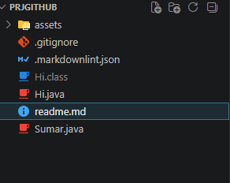

> [!NOTE]
> notas

Link
[https://github.com/MarcoRivera06/Program-II]

## Semana 3

## Java

Inicios de java

Primero vimos la resolución de problemas, como forma de resolver para automatizarlos, todavia no vimos codigo pero si como debería ser el desarollo de los problemas en programación.

como tendríamos que tener un fllujograma del codigo para que se pueda optimizar la resolcuón de los programas al codificar.

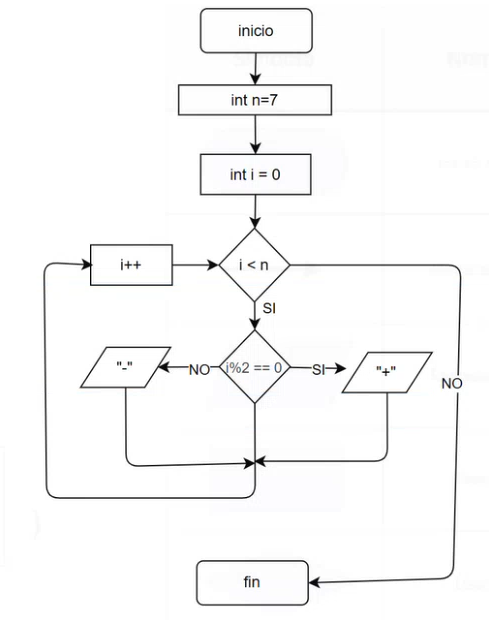

## Semana 4

Forma de solucionar problemas de programación

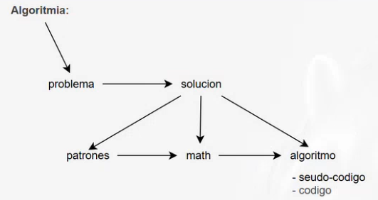

Formas de optimización de código

Una forma de optimización es el uso de un operador terminario
Un operador ternario es un operador que tiene 3 partes (? : ;)

EJEMPLO

```java
//Normal
if (a>10)
      a = 100;
else
      a = -100;


// Optimizado (operador ternario)
a = (a>10) ? 100 : -100;

```

Para resolver problemas de programación lo ultimo que se tiene que hacer es programar, lo primero es tener una buena organización de los archivos o documentos del proyecto a desarollar, lo cual podemos modelar como un diagrama de las clases que tenemos o vamos a tener en DRAWIO.

EJEMPLOS

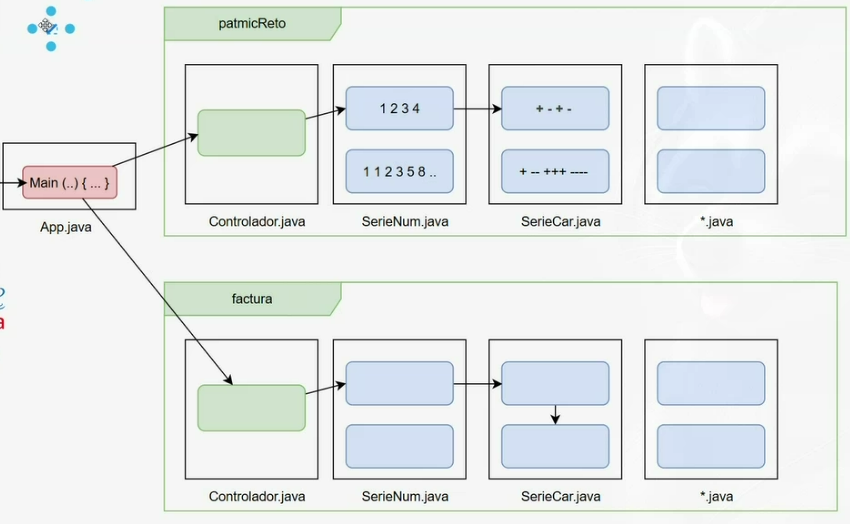

## Semana 5

Vimos como teníamos que hacer neustros deberes y como tenemos que agregarlos al Github, también las formas en las que como grupo tenemos que tener un solo repositorio para todas las personas que son colabroadoras en el repositorio.

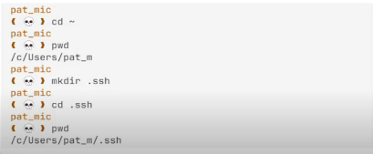

## Propiedades(atributos) y Metodos

Una clase tiene lo que son los atributos y los metodos, a que se refiere los atributos, son aquellas cualidades con las que cumple tal clase.

Por otor lado los metodos con aquellas cosas que la clase puede hacer.

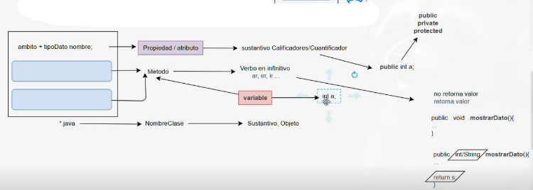

Como podemos ver antes del tipoDato tenemos algo que se llama ambito este puede ser public, private o protected.

Esta semana estuvo un tanto larga a cuestión también de que ya empezamos a programar o a codificar iniciando proyectos en java y haciendo unos cuantos poliretos.

Aquí mi ejemplo.

```java
public class Figuras {
  public void mostrarfigura() {
        int filas = 5;

        for (int i = 0; i < filas; i++) {

            for (int j = 0; j < i * 4; j++) {
                System.out.print(" ");
            }
            if (i == 0) {
                System.out.println("___");
            } else {
                System.out.println("|___");
  }

}
    }
}

```

## Semana 6

en Esta semana empezamos a ver lo que son los Poliretos más a profundidad como usar varias funciones en java y otro tipo de codificación llamado grafos y automoatas.

Me gustaría presentar el grafo.

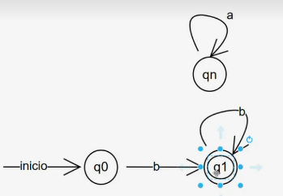

Claro este es un grafo simple, estos grafos se pueden representar matematica mente y gramaticalmente, por supuesto tmbn llevarlo a la codificación.

Claro lo que se debe cumplir para poder realizar un grafo necesitamos lo siguiente.


Donde A es el automata de nuestro problema y necesitamos:

Q -> Conjunto de estados
Σ -> Alfabeto (caracteres que intervienen en el automata)
F -> Estados de aceptacion (q1, q2, q3...)
δ -> Estado de transición
L -> Combinaciones
QFδ
Tenemos el ejemplo de una maquina expendedora

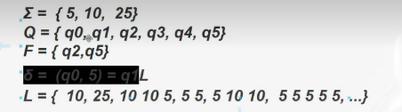

Necesitamos encontrrar patrones para poder resolver con más facilidad estos probelmas, para lo cual necesitamos ahcer una matriz llamada Matriz de Transición

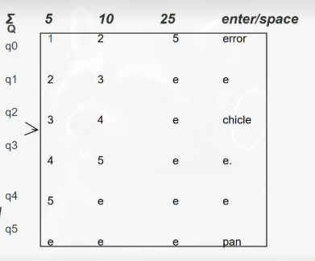

Con ella ya podemos ir a la resolucón final que me gusta llamarlo o codificación de nuestro problema en java.

Al final de esta semana empezamos a ver lo que eran codificación en java demuchas formas

Aqui unos ejemplos hechos por mi de mis deberes y Poliretos.

```java
public class Loading {

    /*
     * L07) Crear una barra es de 20 caracteres, la barra avanza cambiando la punta
     * con
     * movimiento rotacional signos \|/-|
     * [ ==== /
     *
     * ] 20%
     */
    public void loading6() {
        String[] symbols = { "\\", "|", "/", "-" };
        int totalSteps = 20;

        for (int i = 0; i <= totalSteps; i++) {
            int progress = (i * 100) / totalSteps;
            StringBuilder bar = new StringBuilder("[");
            for (int j = 0; j < totalSteps; j++) {
                if (j < i) {
                    bar.append("=");
                } else {
                    bar.append(" ");
                }
            }
            bar.append("] ").append(progress).append("% ").append(symbols[i % symbols.length]);
            System.out.print("\r" + bar.toString());
            try {
                Thread.sleep(200); // Simula el tiempo de carga
            } catch (InterruptedException e) {
                Thread.currentThread().interrupt();
            }
        }
        System.out.println("\nCarga completa!");

        System.out.println("\nLoading con do while");
        int contador = 0;
        try {
            do {
                int progress = (contador * 100) / totalSteps;
                StringBuilder bar = new StringBuilder("[");
                for (int j = 0; j < totalSteps; j++) {
                    if (j < contador) {
                        bar.append("=");
                    } else {
                        bar.append(" ");
                    }
                }
                bar.append("] ").append(progress).append("% ").append(symbols[contador % symbols.length]);
                System.out.print("\r" + bar.toString());
                contador++;
                Thread.sleep(200); // Simula el tiempo de carga
            } while (contador <= totalSteps);
        } catch (InterruptedException e) {
            Thread.currentThread().interrupt();
        }
        System.out.println("\nCarga completa!");

        System.out.println("\nLoading con while");
        contador = 0;
        try {
            while (contador <= totalSteps) {
                int progress = (contador * 100) / totalSteps;
                StringBuilder bar = new StringBuilder("[");
                for (int j = 0; j < totalSteps; j++) {
                    if (j < contador) {
                        bar.append("=");
                    } else {
                        bar.append(" ");
                    }
                }
                bar.append("] ").append(progress).append("% ").append(symbols[contador % symbols.length]);
                System.out.print("\r" + bar.toString());
                contador++;
                Thread.sleep(200); // Simula el tiempo de carga
            }
        } catch (InterruptedException e) {
            Thread.currentThread().interrupt();
        }
    }

}
```

## Semana 7

Vimos como va a ser el examen, la presentacion de tareas, y como va a ser el examen.
hicimos un ejemplo de un deber y ahora vamos a hacer un ejemplo de automatas.

## AUTOMATA

Cear algoritmo que validen correos en la epn
Caracteres del automata Σ = {a...z,.,0...9,@,epn.edu.ec}
L =

Errores cometidos por los estudiantes en los deberes:

- No trabajar en una rama "dev".
- No hacer un pull antes de cambiar hacer el merge de ramas.
- No haberse hecho colaborador del proyecto en GitHub.
- No hacer push en las dos ramas.

> [!NOTE]
> notasTodo esto sirve para poder desarollar en nuna empresa en donde haya varios desarolladores (todas).

## Desarollo de un ejercicio

L = {a+bc* / cd+}
A = <Σ, Q, δ, F>
Σ = {a, b, c, d}
Q = {q0, q1, q2,..., q4}
F = {q2, q4}
δ(q0, a) = q1

## Semana 9

Enterga de notas.

Resoluciòn de un ejercicio de la prueba.

TIPO ARSENAL
a = aviòn
b = barco
c = comboy
d = dron
t = tanque
Cedula : 110343540 -> puede atacar a uno o muchos aviones (a+), o a un aviòn, un barco, un comboy y cero o muchos drones (abcd*).

A=(Σ, Q, δ, F)
L={a+/abcd*}

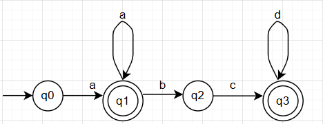

> [!NOTE]
> Siempre podemos empezar por la cadena minima y no puedo tener dos caminos a la misma letra.

Palabras que acepta
>(a)->si acepta,
>(ab) -> no acepta,
>(abc) -> si acepta.

```bash
├── Σ = {a, b, c, d}
├── Q = {q0, q1, q2, q3, q4}
├── F = {q1, q3, q4}
├── δ(q0, a) = q1
```

```bash
Matriz de transición 
   | a | b | c | d | +
q0 | 1 | e | e | e | e
q1 | 3 | 2 | e | e | boom
q2 | e | e | 4 | e | e
q3 | 3 | e | e | e | boom
q4 | e | e | e | 4 | boom
```

AHORA ESTAMOS LISTOS PARA PROGRAMAR.

## Semana 10

Definicion de objeto, clases, atributos y metodos, encapsulamiento, abstraccion.

> [!NOTE]
> Entre mejor puedas saber o ver como es el objeto, se podrà definir muchas màs cosas al objeto.

UML -> lenguaje modelado unificado.

Para crear un use case se necesitan las siguientes lines y figuras.

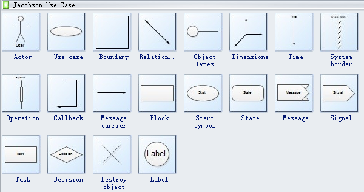

Vamos a ver de un use case a un diagrama de clase, el Use Case sirve para un proceso general.

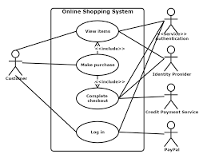

 El "USE CASE" nos ayuda a dinbujar el proceso de negocio con dos puntos básicos.
 -Estado actual
 -Estado futuro

Una vez hecho el use case podemos pasar a un "Diagrama de Clase" y de este sle el codigo por lo cual tiene que ser igual a lo que sale en el diagrama de clase.

> [ERRORES VISTOS EN EL DEBER]:
> Ninguna burbuja va suelta en el diagramado del use case, especificar de mejor forma los metodos en las burbujas para que no se confunda cuando hagamos el diagrama de clase y tmbn darse cuenta que el conjunto de los meotodos sea una generalidad, no es que entr más elipses tenga mejor es más importante que tengas unas bien definidas.

Ejemplo Hecho en clases.
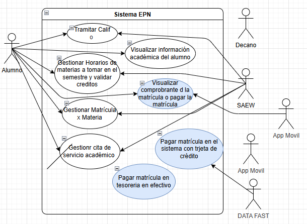

Creación de clases en según el diagrama del Use Case

> [Recomendaciones en el diagrama de clases]:
> los metodos no deben imprimir datos.
